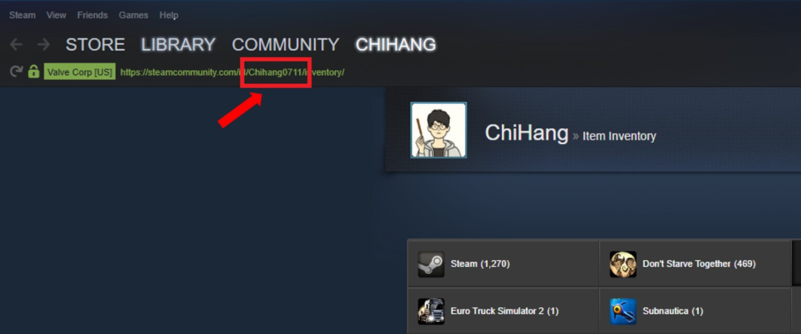

# SteamAutoBoosterPack
This is a simple app develop in python and Qt that allow you make steam boosterpack automatically.

## Usage

#### Setting config

First time of use, please select ***Config*** tab to create a config file with account information.

There are 4 parameter must be set in config file: 

1. Username : Your steam account email.

2. Password : Your steam account password.

3. Inventory ID : Your steam account inventory id, you can find it on the top of your steam inventory, for me is **ChiHang0711**.

  

4. App list : A list of steamm games that you want to create booster pack automatically, this list can be modified by 2 buttons : **Add app** and **Remove app**
* Add app : Enter the steam game id to add the game to list, for add multiple app id, comma seperater can be used. You can get steam app id from [SteamDB](https://steamdb.info/apps/).

* Remove app : Click the checkbox of app you want to remove and click remove button.

After all settings are done, click **Save config** button, and a *config.ini* file will be created.

#### Run making booster pack loop

Go to **Main** tab and click **Start** button, after enter the steam mobile authenticator, the loop will begin and re-run every 4 hours.